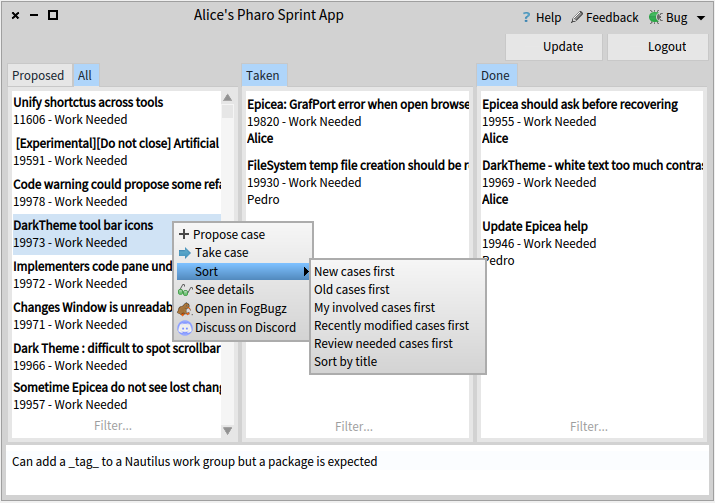
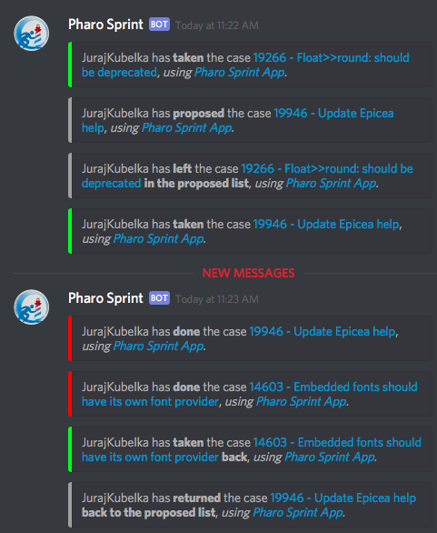

# PharoSprint

Pharo Sprint Application to support coordination and collaboration during Bug Days a.k.a. **Pharo Sprint Days**.

[](https://en.wikipedia.org/wiki/Smalltalk)
[](http://pharo.org/)
[](http://get.pharo.org)
[](https://opensource.org/licenses/MIT/)

[](https://travis-ci.org/JurajKubelka/PharoSprint)
[](https://ci.appveyor.com/project/JurajKubelka/pharosprint/branch/master)
[](https://bob-bench.org/r/gh/JurajKubelka/PharoSprint)
[](https://coveralls.io/github/JurajKubelka/PharoSprint?branch=master)

[](https://bintray.com/jurajkubelka/PharoSprint/release/_latestVersion#files)
[](https://bintray.com/jurajkubelka/PharoSprint/release/_latestVersion#files)
[](https://bintray.com/jurajkubelka/PharoSprint/build/_latestVersion#files)
[](https://bintray.com/jurajkubelka/PharoSprint/build/_latestVersion#files)

## Table Of Contents

- [Introduction](#introduction)
- [Pharo Sprint App Description](#pharo-sprint-app)
- [Discord and FogBugz Integration](#discord-and-fogbugz-integration)
- [How To Use It](#how-to-use-it)
- [Installation](#installation-in-a-fresh-pharo-image)
- [Contribution & Ideas](#contribution--ideas)

## Introduction

Pharo community regularly organize a Pharo Sprint event. The **Pharo Sprint** is a regular (monthly) event when developers and users meet together to fix bugs. This usually takes place in a physical location but people are welcomed to participate from any place. This is a great opportunity for novices to get involved and learn from experts!

When developers meet in a physical location, they typically use a whiteboard with three columns like this:


The **TODO** column is a list of *cases* (issues, bugs), that are proposed to solve during the event. This list is usually written by organizers, but anyone can fill it. The **TAKEN** column is a list of cases, that someone decided to take. Typically, a developer crosses (or deletes) the number from the *TODO* list and writes it down to the *TAKEN* list. Once the developer is done, he or she crosses the number and puts it to the **DONE** column. This is a great way to organize the event smoothly.

As the Pharo community grows, Pharo Sprint events are organized at the same day in different places around the world. And this is the moment, when the *Pharo Sprint App* become handy. The *physical whiteboard* is moved to the internet and shared among the dislocated groups. Moreover, developers see who is working on what and contact him or her on Pharo's Discord server.

## Pharo Sprint App

You can open the application from the World menu. The application follows the structure that was successfully used on the physical whiteboard with three columns: proposed, taken, and done. In addition, it add the *all* column where all open cases are listened and can be sorted in various ways.

First of all, you need to login to FogBugz, using your FogBugz account


Once, you are successfully authenticated, the application updates the list of open cases. Currently it takes about 40 seconds to receive and parse the FogBugz response. So be patient, you need to do it just once :-) Developers then can choose cases from *proposed* and *all* columns, using filters and sorting options.



The following figure shows other actions, that are available for each column.


### Case Info and Details

You can also browse case details in a new window. 


### Discord and FogBugz Integration

Pharo Sprint Application is integrated with [Discord](http://discordapp.com) and [FogBugz](http://www.fogcreek.com/fogbugz/) and is able to inform about user activities (and case changes).




The application does not change case states on FogBugz. In means, that developers have to *produce slices* (commit changes) and *resolve* cases independently on the Pharo Sprint App.

## How To Use It

What to do during the Pharo Sprints?

- Download [the latest image from Bintray](https://bintray.com/jurajkubelka/PharoSprint/build/_latestVersion#files)
- Execute the image, using the corresponding VM for Pharo 6
- Run the application from `World Menu` / `Communication` / `Pharo Sprint`
- Login, using your FogBugz account, wait a bit (about 40 seconds), then you should see all open cases.
- Choose one and have a happy programming :-)

Everybody participating in the sprint should use the Pharo Sprint image.

## Installation in a Fresh Pharo Image

Install it in the latest Pharo 6 image using:

```Smalltalk
Metacello new
    baseline: #PharoSprint;
    repository: 'github://JurajKubelka/PharoSprint/src';
    load.
```

It is up to you if you use the Pharo Sprint App inside of the same image where you fix other cases. It may be worth having it in a separate image, especially if the bug kills the Pharo image.

## Contribution & Ideas

The Pharo Sprint App provides two buttons in order to provide a valuable feedback.


The first button is a form where you can express what you like, what you do not like about the current application and provide any idea how to improve it or how to organize Pharo Sprint events better. The second button is a link to the application's [issue tracker](https://github.com/JurajKubelka/PharoSprint/issues). And you are welcome to clone this repository and make the contribution too :-)
